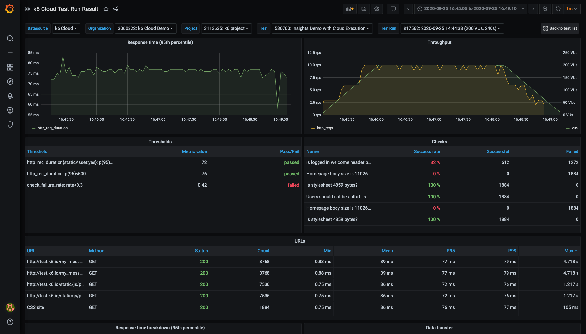

# k6 Cloud Grafana Data Source Plugin

Thi Grafana data source plugin allows you to view your tests results stored in k6 Cloud in Grafana.



## Prerequisites
- Docker Engine with Compose installed
- Node.js 12.x (lts/erbium) installed
- Yarn or npm

## Getting started

The instructions below will get you set up with a Docker Compose based Grafana setup to quickly try the plugin. Instructions for installing the plugin with a self-hosted version of Grafana follows further down.

1. Install dependencies
```BASH
# Yarn
yarn install

# npm
npm install
```

2. Build plugin in production mode
```BASH
# Yarn
yarn build

# npm
npm run build
```

3. Start Grafana with Docker Compose
```BASH
docker-compose up -d
```

4. Open Grafana in your browser: [http://localhost:3000/](http://localhost:3000/)
5. Install the k6 Cloud data source (search for `k6`): [http://localhost:3000/datasources](http://localhost:3000/datasources)
6. Configure the data source by entering your k6 Cloud API token ([found here](https://app.k6.io/account/api-token)): [http://localhost:3000/datasources/edit/1/](http://localhost:3000/datasources/edit/1/)
7. Visit the "Dashboards" tab and "import" the two dashboards that come with the data source plugin: [http://localhost:3000/datasources/edit/1/dashboards](http://localhost:3000/datasources/edit/1/dashboards)
8. Visit the test runs list dashboard to start using exploring your k6 Cloud account from Grafana: [http://localhost:3000/d/k6-cloud-test-runs/k6-cloud-test-runs-list](http://localhost:3000/d/k6-cloud-test-runs/k6-cloud-test-runs-list)

## Installation with self-hosted Grafana

If you're self-hosting a Grafana installation you can follow the steps below to get the plugin setup:

1. Install dependencies
```BASH
# Yarn
yarn install

# npm
npm install
```
2. Build plugin in production mode
```BASH
# Yarn
yarn build

#npm
npm run build
```
3. Install plugin by copying the files from `./dist` to your Grafana plugin directory
```BASH
cp -r ./dist /your/grafana/plugin/directory/k6-cloud-datasource
```
**Linux**: By default, the Linux plugin location is: `/var/lib/grafana/plugins`

**macOS**: By default, the Mac plugin location is: `/usr/local/var/lib/grafana/plugins`

4. Make sure you have [configured your Grafana installation](https://grafana.com/docs/grafana/latest/administration/configuration/) to allow unsigned plugins
```INI
...
[plugins]
allow_loading_unsigned_plugins=true
...
```
5. Restart Grafana to allow it to discover the new plugin, on Linux:
```BASH
service grafana-server restart
```
on macOS:
```BASH
brew services restart grafana
```

## Learn more
- [k6 Cloud](https://k6.io/)
- [Grafana documentation](https://grafana.com/docs/)
